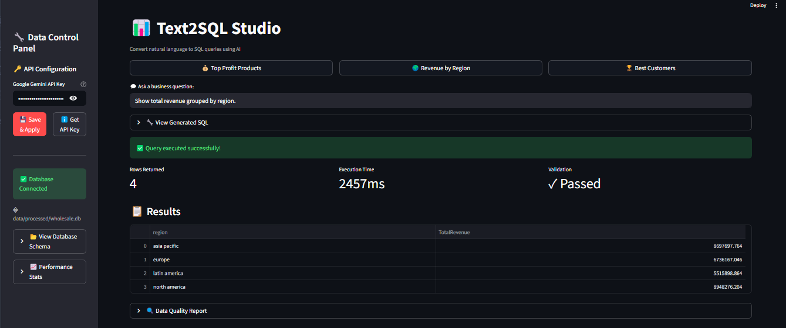
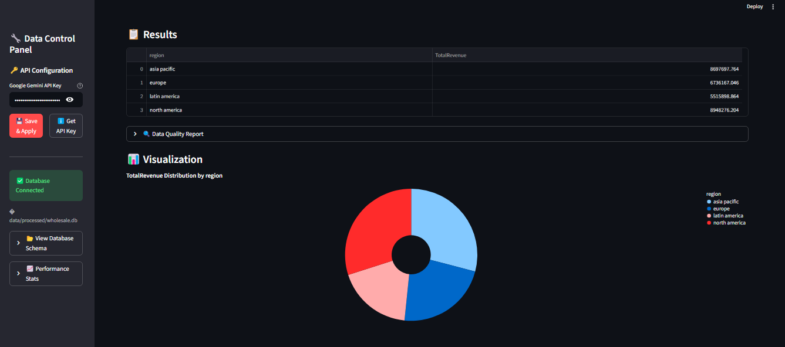
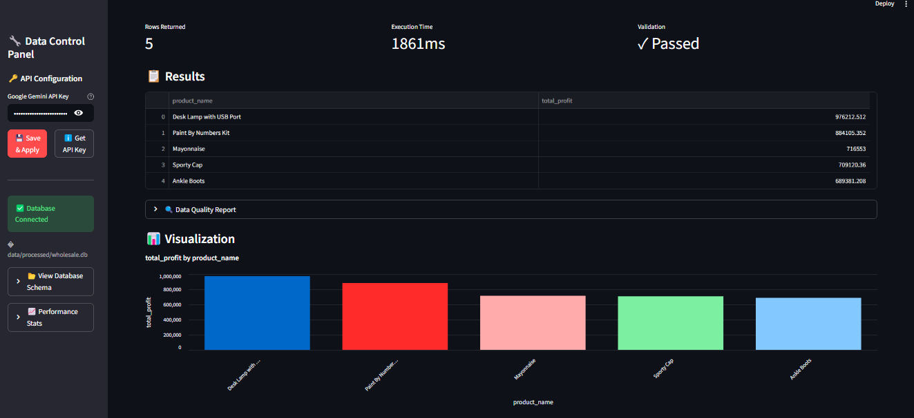

# Text2SQL Studio

A production-grade Text-to-SQL system powered by Google's Gemini AI, designed for reproducibility, scientific evaluation, and secure collaboration.





## Project Structure

```
my_project/
├── data/
│   ├── raw/                    
│   ├── processed/              wholesale.db SQLite database
│   └── gold_standard/          
│       └── eval_set.json       10 standard queries
├── src/
│   ├── core/                   
│   │   ├── llm.py              Gemini AI client with rate limiting
│   │   ├── db.py               Read-only database client
│   │   ├── validation.py       Pandera schemas for data quality
│   │   ├── logger.py           Experiment tracking
│   │   └── engine.py           Main Text2SQL orchestrator
│   ├── evaluation/             
│   │   ├── metrics.py          Accuracy, validity calculations
│   │   └── run_eval.py         Batch evaluation runner
│   └── config.py               Pydantic settings (env vars)
├── experiments/
│   └── logs.csv                Append-only experiment log
├── notebooks/
│   └── exploration.ipynb       Interactive usage examples
├── tests/                      Unit tests (pytest)
├── app.py                      Streamlit dashboard
├── .env.example                Environment variable template
├── requirements.txt            Python dependencies
└── README.md                   This file
```

## Quick Start

### 1. Clone and Setup

```bash
pip install -r requirements.txt
cp .env.example .env
```

### 2. Configure Environment

Edit `.env` and add your credentials:

```env
GOOGLE_API_KEY=your_actual_api_key_here
DB_PATH=data/processed/wholesale.db
MODEL_VERSION=gemini-2.5-flash
```

### 3. Add Database

Place your `wholesale.db` file in `data/processed/`.

### 4. Run the Application

```bash
streamlit run app.py
```

## Database Schema

**clients**: `client_id`, `company_name`, `region`, `contact_name`, `contact_email`

**catalog**: `product_id`, `product_name`, `category`, `cost_price`, `unit_price`

**invoices**: `invoice_id`, `client_id`, `product_id`, `invoice_date`, `quantity`

## Scientific Evaluation

### Run Evaluation Pipeline

```bash
python -m src.evaluation.run_eval
```

This will:
1. Load 10 standard queries from `data/gold_standard/eval_set.json`
2. Generate SQL for each question
3. Compare results against ground truth
4. Calculate metrics:
   - Execution Accuracy: % of queries returning correct results
   - Validity Rate: % of generated SQL that executes without errors
   - Row Count Accuracy: % matching expected result sizes

### View Results

Results are saved to `experiments/eval_results_v1.json` and printed to console.

## Using in Jupyter Notebooks

```python
from src.core.engine import Text2SQLEngine

engine = Text2SQLEngine()

df, metadata = engine.ask("What is the total revenue by region?")

df.plot(kind='bar', x='region', y='revenue')
```

See `notebooks/exploration.ipynb` for full examples.

## Running Tests

```bash
pytest tests/ -v
```

## Security Features

- No hardcoded API keys (uses `.env`)
- Read-only database access (prevents accidental modifications)
- Query validation before execution
- Rate limiting on API calls
- `.gitignore` includes `.env` and sensitive files

## Experiment Tracking

All queries are automatically logged to `experiments/logs.csv` with:
- Timestamp
- Prompt version
- User question
- Generated SQL
- Success/failure status
- Execution time
- Validation results

### Analyze Experiments

```python
from src.core.logger import ExperimentLogger

logger = ExperimentLogger()
success_rate = logger.get_success_rate(prompt_version="v1")
print(f"Success rate: {success_rate}%")
```

## Streamlit Dashboard Features

- Natural language query interface
- Live schema viewer
- Auto-generated visualizations (bar/donut charts)
- Real-time performance statistics
- Data quality validation
- SQL query inspector

## Iterating on Prompts

1. Modify `SYSTEM_PROMPT` in `src/core/llm.py`
2. Update `prompt_version` when creating engine
3. Run evaluation: `python -m src.evaluation.run_eval`
4. Compare results across versions in `experiments/`

## Data Validation

Results are validated using Pandera schemas to ensure:
- Revenue/Profit values are non-negative
- Regions match known values
- Quantities are positive integers
- No data quality issues (nulls, negatives where inappropriate)

## Advanced Usage

### Custom Validation Schema

```python
from src.core.validation import validate_result
import pandas as pd

df = my_query_results
is_valid, error = validate_result(df, schema_type="financial")
```

### Manual SQL Execution

```python
from src.core.db import DatabaseClient

db = DatabaseClient()
results = db.execute_query("SELECT * FROM clients LIMIT 5")
```

## Roadmap

- RAG integration with ChromaDB for few-shot learning
- Semantic layer with `metrics.yaml` for business definitions
- Query caching to reduce API costs
- Multi-model support (GPT-4, Claude)
- Auto-generated documentation from schema

## Contributing

This project follows data science best practices:
- Type hints throughout
- Modular, importable components


